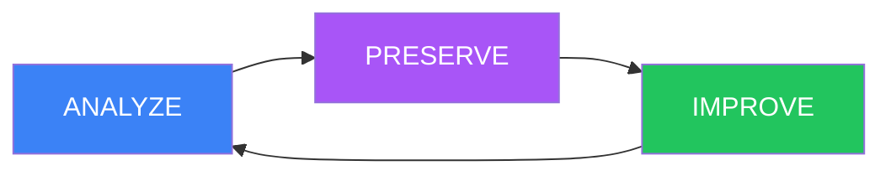

# Domain-Driven Development (DDD) Guide

ANALYZE-PRESERVE-IMPROVE methodology for legacy code refactoring.

---

## Overview

DDD (Domain-Driven Development) is a methodology for safely refactoring existing code with low test coverage. It focuses on **behavior preservation** through characterization tests.

---

## The DDD Cycle



### Phase 1: ANALYZE

Understand existing behavior and code structure.

**Activities:**
- Read existing code
- Identify dependencies
- Map domain boundaries
- Find side effects
- Document implicit contracts

**Questions to Ask:**
- What does this code do?
- What are the inputs and outputs?
- What are the side effects?
- What dependencies does it have?
- What are the edge cases?

**Example Analysis:**

```typescript
// Existing code: processOrder()
//
// What it does:
// - Validates order status
// - Calculates total
// - Updates inventory
// - Sends confirmation email
// - Creates transaction record
//
// Dependencies:
// - Order repository
// - Inventory service
// - Email service
// - Payment service
//
// Side effects:
// - Database writes (order, inventory, transaction)
// - Email sent
// - External API call (payment)
//
// Edge cases:
// - Invalid order status
// - Insufficient inventory
// - Payment failure
// - Email send failure
```

---

### Phase 2: PRESERVE

Create characterization tests that capture current behavior.

**Purpose:**
- Document current behavior
- Create safety net for refactoring
- Prevent regressions
- Enable confident changes

**What are Characterization Tests?**

Tests that describe **what the code currently does**, not what it **should do**.

**Example:**

```typescript
describe('processOrder (characterization)', () => {
  it('should process valid order', async () => {
    // Setup: Create order in valid state
    const order = await createTestOrder({ status: 'PENDING' });

    // Act: Run the code
    const result = await processOrder(order.id);

    // Assert: Document current behavior
    expect(result.status).toBe('CONFIRMED');
    expect(result.total).toBeGreaterThan(0);
    expect(result.confirmationEmailSent).toBe(true);
  });

  it('should handle inventory shortage', async () => {
    // Setup: Create order with insufficient inventory
    const order = await createTestOrder({
      status: 'PENDING',
      items: [{ productId: 'out-of-stock', quantity: 100 }]
    });

    // Act: Run the code
    const result = await processOrder(order.id);

    // Assert: Document current behavior (may be unexpected!)
    expect(result.status).toBe('FAILED');
    expect(result.error).toBe('Insufficient inventory');
    expect(result.confirmationEmailSent).toBe(false);
  });
});
```

**Behavior Snapshots**

Use snapshots to capture complex state:

```typescript
it('should update order correctly', async () => {
  const before = await getOrder(orderId);
  await processOrder(orderId);
  const after = await getOrder(orderId);

  expect(after).toMatchSnapshot({
    status: 'CONFIRMED',
    total: expect.any(Number),
    updatedAt: expect.any(Date)
  });
});
```

---

### Phase 3: IMPROVE

Make incremental changes with test protection.

**Rules:**
1. Make small, incremental changes
2. Run characterization tests after each change
3. Never break characterization tests
4. Refactor with confidence

**Example Improvements:**

#### Step 1: Extract Function

```typescript
// Before
async function processOrder(orderId: string) {
  const order = await getOrder(orderId);
  const total = order.items.reduce((sum, item) => sum + item.price, 0);
  order.total = total;
  await updateOrder(order);
  // ... 50 more lines
}

// After (extracted)
async function processOrder(orderId: string) {
  const order = await getOrder(orderId);
  const total = calculateOrderTotal(order);
  order.total = total;
  await updateOrder(order);
  // ... rest of code
}

function calculateOrderTotal(order: Order): number {
  return order.items.reduce((sum, item) => sum + item.price, 0);
}
```

**Run tests** → All pass

#### Step 2: Improve Error Handling

```typescript
// Before
if (order.status !== 'PENDING') {
  throw new Error('Invalid status');
}

// After (extracted)
function validateOrderStatus(order: Order): void {
  const validStatuses = ['PENDING', 'PARTIALLY_CONFIRMED'];
  if (!validStatuses.includes(order.status)) {
    throw new OrderProcessingError(
      `Invalid order status: ${order.status}`,
      order.status
    );
  }
}
```

**Run tests** → All pass

#### Step 3: Reduce Coupling

```typescript
// Before (tightly coupled)
async function processOrder(orderId: string) {
  const order = await db.orders.findOne({ id: orderId });
  await db.inventory.update(...);
  await emailService.send(...);
  await paymentService.charge(...);
}

// After (dependency injection)
interface OrderProcessorDependencies {
  orderRepo: OrderRepository;
  inventoryService: InventoryService;
  emailService: EmailService;
  paymentService: PaymentService;
}

async function processOrder(
  orderId: string,
  deps: OrderProcessorDependencies
): Promise<OrderResult> {
  const order = await deps.orderRepo.findById(orderId);
  // ... rest of code
}
```

**Run tests** → All pass

---

## DDD Rules

### Strict Rules

1. **Analyze before changing** - Never modify code without understanding it
2. **Preserve behavior first** - Create characterization tests before improvements
3. **Improve incrementally** - Small changes, test after each
4. **Maintain characterization tests** - They protect against regressions

### Test Coverage

| Metric | Target |
|--------|--------|
| **Characterization Tests** | All code paths |
| **New Code Coverage** | 85%+ |
| **Overall Improvement** | Maintain or increase |

---

## When to Use DDD

### Good for DDD

- Legacy code with < 10% coverage
- Refactoring existing features
- API migration
- Database schema changes
- Bug fixing in unfamiliar code

### Not Good for DDD

- New features (use TDD)
- Greenfield projects (use TDD)
- Simple configurations
- Documentation updates

---

## DDD vs. TDD

| Aspect | DDD | TDD |
|--------|-----|-----|
| **When** | Existing code | New code |
| **Test Timing** | After analysis | Before implementation |
| **Focus** | Behavior preservation | Feature development |
| **Test Type** | Characterization tests | Unit tests |
| **Cycle** | ANALYZE-PRESERVE-IMPROVE | RED-GREEN-REFACTOR |
| **Goal** | Safe refactoring | Test-driven design |

---

## Hybrid Mode (Default)

MoAI-ADK uses **Hybrid mode** for mixed projects:

**For NEW code:**
- Use TDD (RED-GREEN-REFACTOR)
- Write tests first
- 85%+ coverage required

**For EXISTING code:**
- Use DDD (ANALYZE-PRESERVE-IMPROVE)
- Characterization tests first
- Preserve existing behavior
- Incremental improvements

---

## Example: Complete DDD Session

### Feature: Refactor User Authentication

#### ANALYZE Phase

```typescript
// Existing authenticate() function
//
// Current behavior:
// 1. Looks up user by email
// 2. Compares plaintext password (security issue!)
// 3. Returns user object if match
// 4. Returns null if no match
//
// Issues:
// - Plaintext password comparison
// - No rate limiting
// - No account lockout
// - Returns null (not informative)
//
// Dependencies:
// - Database connection
// - User model
//
// Side effects:
// - Last login updated
// - Login attempt logged
```

#### PRESERVE Phase

```typescript
describe('authenticate (characterization)', () => {
  it('should authenticate valid user', async () => {
    // Setup: Create user with known password
    await createUser({
      email: 'user@example.com',
      password: 'plaintext123'  // Note: stored in plaintext!
    });

    // Act: Authenticate
    const result = await authenticate('user@example.com', 'plaintext123');

    // Assert: Document current behavior
    expect(result).not.toBeNull();
    expect(result.email).toBe('user@example.com');
  });

  it('should return null for invalid password', async () => {
    await createUser({
      email: 'user@example.com',
      password: 'plaintext123'
    });

    const result = await authenticate('user@example.com', 'wrong');

    // Assert: Current behavior returns null
    expect(result).toBeNull();
  });

  it('should update last login', async () => {
    const user = await createUser({
      email: 'user@example.com',
      password: 'plaintext123'
    });

    const before = user.lastLoginAt;
    await authenticate('user@example.com', 'plaintext123');
    const after = await getUser(user.id);

    // Assert: Last login was updated
    expect(after.lastLoginAt).not.toEqual(before);
  });
});
```

#### IMPROVE Phase (Incremental)

**Improvement 1: Fix password security**

```typescript
// After: Use bcrypt (maintains behavior!)
async function authenticate(email: string, password: string): Promise<User | null> {
  const user = await User.findOne({ email });
  if (!user) return null;

  // Use bcrypt instead of plaintext compare
  const isValid = await bcrypt.compare(password, user.passwordHash);

  if (isValid) {
    user.lastLoginAt = new Date();
    await user.save();
    return user;
  }

  return null;
}
```

**Run characterization tests** → All pass (behavior preserved!)

**Improvement 2: Add rate limiting**

```typescript
// Add rate limiting (non-breaking change)
async function authenticate(
  email: string,
  password: string,
  options?: { skipRateLimit?: boolean }
): Promise<User | null> {
  if (!options?.skipRateLimit) {
    await checkRateLimit(email);
  }

  // ... existing code
}
```

**Run characterization tests** → All pass (new option, old behavior unchanged!)

**Improvement 3: Better error handling**

```typescript
// Add informative errors (extends behavior, doesn't break)
async function authenticate(
  email: string,
  password: string
): Promise<User> {
  const user = await User.findOne({ email });
  if (!user) {
    throw new AuthenticationError('User not found', email);
  }

  const isValid = await bcrypt.compare(password, user.passwordHash);
  if (!isValid) {
    throw new AuthenticationError('Invalid password');
  }

  // ... rest of code
}
```

**Run characterization tests** → Update tests to expect errors instead of null

---

## Common Pitfalls

### 1. Skipping Characterization Tests

Don't skip the PRESERVE phase. Without tests, you have no safety net.

### 2. Large Changes

Break large changes into small, testable increments.

### 3. Ignoring Current Behavior

Even if current behavior seems wrong, document it first. Change it in a separate step.

### 4. Deleting Characterization Tests

Keep characterization tests! They protect against future regressions.

---

## References

- [TDD Guide](./tdd.md)
- [TRUST 5 Framework](./trust5.md)
- [MoAI DDD Workflow](../moai-adk/agents.md#manager-ddd)

---

*Last updated: 2026-03-01*
