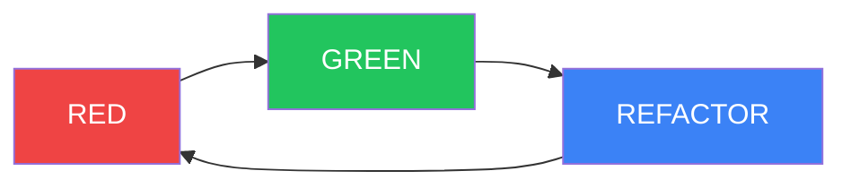

# Test-Driven Development (TDD) Guide

RED-GREEN-REFACTOR methodology for test-first development.

---

## Overview

TDD is a development approach where tests are written **before** the implementation code. This ensures that code is designed to be testable from the start.

---

## The TDD Cycle



### Phase 1: RED

Write a **failing test** that describes the desired behavior.

**Purpose:**
- Define the requirements
- Ensure the test fails (confirms it tests something new)
- Drive the design of the interface

**Example:**

```typescript
describe('calculateTotal', () => {
  it('should calculate subtotal with tax', () => {
    // Arrange
    const items = [
      { price: 100, quantity: 2 },
      { price: 50, quantity: 1 }
    ];
    const taxRate = 0.16;

    // Act
    const result = calculateTotal(items, taxRate);

    // Assert
    expect(result).toBe(290); // (200 + 50) * 1.16 = 290
  });
});
```

Run test → **FAILS** (function doesn't exist yet)

---

### Phase 2: GREEN

Write the **minimum code** to make the test pass.

**Purpose:**
- Make the test pass
- Focus on correctness, not elegance
- No premature optimization

**Example:**

```typescript
function calculateTotal(items: Item[], taxRate: number): number {
  const subtotal = items.reduce((sum, item) => {
    return sum + (item.price * item.quantity);
  }, 0);
  return subtotal * (1 + taxRate);
}
```

Run test → **PASSES**

---

### Phase 3: REFACTOR

Improve the code while keeping tests green.

**Purpose:**
- Clean up implementation
- Extract patterns
- Apply design principles
- Maintain test coverage

**Example (refactored):**

```typescript
function calculateSubtotal(items: Item[]): number {
  return items.reduce((sum, item) => sum + (item.price * item.quantity), 0);
}

function calculateTax(subtotal: number, taxRate: number): number {
  return subtotal * taxRate;
}

function calculateTotal(items: Item[], taxRate: number): number {
  const subtotal = calculateSubtotal(items);
  const tax = calculateTax(subtotal, taxRate);
  return subtotal + tax;
}
```

Run test → **STILL PASSES**

---

## TDD Rules

### Strict Rules

1. **No code without tests** - All code must be tested first
2. **One test at a time** - Write one test, make it pass, then move on
3. **Minimal implementation** - Write the simplest code that passes
4. **Refactor only when green** - Never refactor with failing tests

### Test Coverage

| Metric | Target |
|--------|--------|
| **Overall Coverage** | 85%+ |
| **New Code** | 100% |
| **Critical Paths** | 100% |
| **Edge Cases** | Covered |

---

## Test Structure

### AAA Pattern (Arrange-Act-Assert)

```typescript
it('should do X when Y', () => {
  // Arrange: Set up the test
  const input = { value: 10 };
  const expected = 20;

  // Act: Execute the code
  const result = doubleValue(input.value);

  // Assert: Verify the result
  expect(result).toBe(expected);
});
```

---

## Common Test Patterns

### Testing Async Code

```typescript
// Using async/await
it('should fetch user', async () => {
  const user = await fetchUser('user_123');
  expect(user).toBeDefined();
  expect(user.email).toBe('user@example.com');
});

// Using promises
it('should fetch user', () => {
  return fetchUser('user_123').then(user => {
    expect(user.email).toBe('user@example.com');
  });
});
```

### Testing Errors

```typescript
it('should throw when user not found', () => {
  expect(() => {
    getUser('nonexistent');
  }).toThrow('User not found');
});

// Async errors
it('should throw when API fails', async () => {
  await expect(
    fetchUser('invalid')
  ).rejects.toThrow('Invalid user ID');
});
```

### Mocking Dependencies

```typescript
import { jest } from '@jest/globals';

// Mock function
const mockDb = { find: jest.fn() };

it('should return user from database', async () => {
  mockDb.find.mockResolvedValue({ id: '123', name: 'Test' });

  const result = await getUser('123', mockDb);

  expect(result).toEqual({ id: '123', name: 'Test' });
  expect(mockDb.find).toHaveBeenCalledWith('123');
});
```

---

## When to Use TDD

### Good for TDD

- New features
- New modules
- Isolated business logic
- API endpoints
- Data transformations

### Not Good for TDD

- UI mockups
- Configuration files
- Simple CRUD (can use generated tests)
- Learning/exploration code

---

## TDD vs. DDD

| Aspect | TDD | DDD |
|--------|-----|-----|
| **When** | New code | Existing code |
| **Test Timing** | Before code | After analysis |
| **Focus** | Behavior preservation | Feature development |
| **Test Type** | Unit tests | Characterization tests |
| **Cycle** | RED-GREEN-REFACTOR | ANALYZE-PRESERVE-IMPROVE |

---

## Example: Complete TDD Session

### Feature: Calculate Loyalty Points

#### Test 1: Base points

```typescript
// RED
it('should award 1 point per $1 spent', () => {
  const points = calculateLoyaltyPoints(100);
  expect(points).toBe(100);
});

// GREEN
function calculateLoyaltyPoints(amount: number): number {
  return amount;
}
```

#### Test 2: Multiplier

```typescript
// RED
it('should award 2x points for marina reservations', () => {
  const points = calculateLoyaltyPoints(100, 'MARINA');
  expect(points).toBe(200);
});

// GREEN (refactored)
function calculateLoyaltyPoints(amount: number, type: string = 'GENERAL'): number {
  const multipliers = {
    GENERAL: 1,
    MARINA: 2,
    GOLF: 1.5
  };
  return amount * (multipliers[type] || 1);
}
```

#### Test 3: Rounding

```typescript
// RED
it('should round down partial points', () => {
  const points = calculateLoyaltyPoints(99.99, 'GOLF');
  expect(points).toBe(149); // 99.99 * 1.5 = 149.985 → 149
});

// GREEN (refactored)
function calculateLoyaltyPoints(amount: number, type: string = 'GENERAL'): number {
  const multipliers = {
    GENERAL: 1,
    MARINA: 2,
    GOLF: 1.5
  };
  return Math.floor(amount * (multipliers[type] || 1));
}
```

#### Final Code (after refactoring)

```typescript
type LoyaltyType = 'GENERAL' | 'MARINA' | 'GOLF';

const LOYALTY_MULTIPLIERS: Record<LoyaltyType, number> = {
  GENERAL: 1,
  MARINA: 2,
  GOLF: 1.5
};

function calculateLoyaltyPoints(amount: number, type: LoyaltyType = 'GENERAL'): number {
  const multiplier = LOYALTY_MULTIPLIERS[type];
  return Math.floor(amount * multiplier);
}
```

---

## Running Tests

### Commands

```bash
# Run all tests
npm test

# Run tests in watch mode
npm test -- --watch

# Run tests with coverage
npm run test:coverage

# Run specific test file
npm test -- loyalty.test.ts

# Run tests matching pattern
npm test -- --testNamePattern="loyalty"
```

---

## Common Pitfalls

### 1. Testing Implementation Details

**Bad:**
```typescript
it('should use reduce', () => {
  const spy = jest.spyOn(Array.prototype, 'reduce');
  calculateTotal(items, 0.16);
  expect(spy).toHaveBeenCalled();
});
```

**Good:**
```typescript
it('should calculate total correctly', () => {
  const result = calculateTotal(items, 0.16);
  expect(result).toBe(290);
});
```

### 2. Writing Tests After Code

This defeats the purpose of TDD. Always write tests first.

### 3. Over-Mocking

Too many mocks make tests brittle. Mock only external dependencies.

### 4. Testing Trivial Code

Don't test simple getters or data structures.

---

## References

- [DDD Guide](./ddd.md)
- [TRUST 5 Framework](./trust5.md)
- [Testing Best Practices](../moai-adk/quality-gates.md)

---

*Last updated: 2026-03-01*
