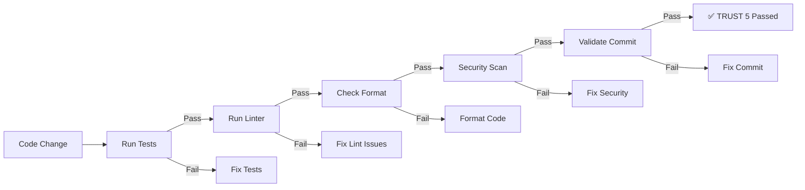

# TRUST 5 Framework

Quality validation framework for code changes.

---

## Overview

TRUST 5 is a quality framework that validates code changes against **five quality criteria** before they are committed.

---

## The 5 Criteria


---

## T - Tested

Code must be tested with sufficient coverage.

### Requirements

| Metric | Threshold | Tool |
|--------|-----------|------|
| **Overall Coverage** | 85%+ | jest, pytest, go test |
| **New Code** | 100% | - |
| **Critical Paths** | 100% | - |
| **All Tests Passing** | 0 failures | Test runner |

### Validation

```bash
# Run tests
npm test

# With coverage
npm run test:coverage

# Example output
--------------------|---------|----------|---------|
File                | % Stmts | % Branch | % Funcs |
--------------------|---------|----------|---------|
All files           |   87.5  |    85.2  |   90.1  |
```

### Coverage Exemptions

Exemptions require justification:

```typescript
// EXEMPTION: Generated code (no control over coverage)
// EXEMPTION: External SDK wrapper (tested by SDK)
// EXEMPTION: Debug logging (low business value)
```

---

## R - Readable

Code must be clear and maintainable.

### Requirements

| Metric | Threshold | Tool |
|--------|-----------|------|
| **Lint Errors** | 0 | ESLint, golangci-lint |
| **Lint Warnings** | < 10 | ESLint, golangci-lint |
| **Naming Conventions** | Followed | Linter |
| **Code Comments** | English only | Human review |

### Validation

```bash
# Run linter
npm run lint

# Example output
✓ All files pass linting (0 errors, 2 warnings)
```

### Naming Conventions

| Language | Variables | Functions | Classes/Types | Constants |
|----------|-----------|-----------|--------------|-----------|
| **JavaScript/TypeScript** | camelCase | camelCase | PascalCase | UPPER_SNAKE |
| **Go** | camelCase | PascalCase (exported) | PascalCase | UPPER_SNAKE |
| **Python** | snake_case | snake_case | PascalCase | UPPER_SNAKE |

### Code Style

- **No magic numbers** (use constants)
- **Descriptive names** (avoid `x`, `data`, `tmp`)
- **Single responsibility** (one thing per function)
- **Clear error messages** (not "Error occurred")

---

## U - Unified

Code must be consistently formatted.

### Requirements

| Metric | Threshold | Tool |
|--------|-----------|------|
| **Formatted** | 100% | Prettier, black, gofmt |
| **Import Order** | Consistent | Linter |
| **Line Length** | < 100 chars | Linter |

### Validation

```bash
# Check formatting
npm run format:check

# Auto-format
npm run format

# Example output
⚠️  5 files need formatting
✓ Formatted 5 files
```

### Configuration

**Prettier (.prettierrc):**

```json
{
  "semi": true,
  "trailingComma": "es5",
  "singleQuote": false,
  "printWidth": 100,
  "tabWidth": 2
}
```

**Go:**

```bash
gofmt -w .
```

**Python:**

```bash
black .
```

---

## S - Secured

Code must be secure and follow OWASP guidelines.

### Requirements

| Risk | Mitigation |
|------|------------|
| **Injection** | Parameterized queries |
| **Broken Auth** | JWT with refresh tokens |
| **XSS** | Input sanitization |
| **Crypto** | AES-256 for PII |
| **Authorization** | RBAC enforced |

### Validation

```bash
# Security scan
npm audit

# Snyk scan
snyk test

# Example output
✓ 0 vulnerabilities found
```

### Security Checklist

- [ ] No hardcoded secrets
- [ ] All PII encrypted
- [ ] Input validation on all endpoints
- [ ] SQL injection prevented
- [ ] XSS prevention enabled
- [ ] CSRF protection enabled
- [ ] Rate limiting configured
- [ ] Authentication required for protected routes

---

## T - Trackable

Code changes must be traceable to requirements.

### Requirements

| Metric | Format |
|--------|--------|
| **Commit Messages** | Conventional Commits |
| **Issue References** | Linked to tickets/SPECs |
| **Logging** | Structured, contextual |

### Commit Format

```
<type>(<scope>): <description>

[optional body]

[optional footer]
```

**Types:** `feat`, `fix`, `docs`, `style`, `refactor`, `perf`, `test`, `chore`

**Examples:**

```
feat(auth): add JWT refresh token rotation

- Implement refresh token rotation
- Add refresh token endpoint
- Update auth middleware

Closes #123
Related to SPEC-AUTH-001
```

### Logging

```typescript
// Good: Structured logging
logger.info('User logged in', {
  userId: user.id,
  timestamp: new Date().toISOString(),
  ip: req.ip
});

// Bad: Unstructured
console.log('User logged in');
```

---

## Quality Gate Workflow



---

## Pre-Commit Hook

Automated TRUST 5 validation:

```bash
#!/bin/bash
# .git/hooks/pre-commit

echo "🔍 Running TRUST 5 validation..."

# T - Tested
echo "  ✓ Running tests..."
npm test -- --silent || exit 1

# R - Readable
echo "  ✓ Running linter..."
npm run lint -- --quiet || exit 1

# U - Unified
echo "  ✓ Checking format..."
npm run format:check || exit 1

# S - Secured
echo "  ✓ Security audit..."
npm audit --production || exit 1

# T - Trackable
echo "  ✓ Validating commit..."
# Conventional commit check
commit_regex='^(feat|fix|docs|style|refactor|perf|test|chore)(\(.+\))?: .{1,50}'
if ! grep -qE "$commit_regex" "$1"; then
  echo "❌ Invalid commit message format"
  exit 1
fi

echo "✅ TRUST 5 validation passed!"
```

---

## CI/CD Integration

### GitHub Actions

```yaml
name: TRUST 5 Quality Gate

on: [push, pull_request]

jobs:
  trust5:
    runs-on: ubuntu-latest
    steps:
      - uses: actions/checkout@v3

      - name: T - Tested
        run: npm test

      - name: T - Coverage
        run: npm run test:coverage

      - name: R - Readable
        run: npm run lint

      - name: U - Unified
        run: npm run format:check

      - name: S - Secured
        run: npm audit --production

      - name: T - Trackable
        run: |
          if ! git log -1 --format=%s | grep -qE '^(feat|fix|docs|style|refactor|perf|test|chore)'; then
            echo "Invalid commit format"
            exit 1
          fi
```

---

## Quick Reference

| Criterion | Command | Success |
|-----------|---------|---------|
| **Tested** | `npm test` | 0 failures, 85%+ coverage |
| **Readable** | `npm run lint` | 0 errors, < 10 warnings |
| **Unified** | `npm run format:check` | 0 files need formatting |
| **Secured** | `npm audit` | 0 vulnerabilities |
| **Trackable** | (git hook) | Conventional commit format |

---

## Failure Handling

### If Tests Fail

1. Fix failing tests
2. Add missing tests if needed
3. Re-run until all pass

### If Linter Fails

1. Fix lint errors
2. Address warnings (or justify)
3. Re-run until clean

### If Format Fails

1. Run `npm run format`
2. Review changes
3. Commit formatted code

### If Security Scan Fails

1. Update vulnerable dependencies
2. Or add security exemption (with justification)
3. Re-run until clean

### If Commit Format Fails

1. Rewrite commit message
2. Use conventional commit format
3. Re-run validation

---

## Waivers

In rare cases, TRUST 5 criteria can be waived:

```typescript
// WAIVER: TRUST5-READABLE-001
// Justification: Legacy code, will be refactored in SPEC-REF-002
// Approved by: @tech-lead
// Date: 2026-03-01
// Expires: 2026-04-01
```

---

## References

- [TDD Guide](./tdd.md)
- [DDD Guide](./ddd.md)
- [Development Setup](./development.md)

---

*Last updated: 2026-03-01*
