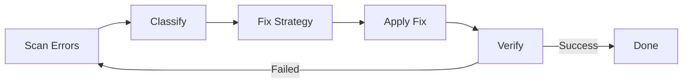

# moai-adk Architecture

Technical architecture and internal design of MoAI-ADK.

---

## Overview

MoAI-ADK is written in **Go 1.25+** as a single binary with zero external dependencies. It uses Go's `embed` directive to bundle templates and configuration.

---

## Directory Structure

```
moai-adk/
├── cmd/
│   └── moai/
│       └── main.go              # Application entry point
├── internal/                    # Private packages
│   ├── astgrep/                 # AST-grep integration
│   ├── cli/                     # Cobra CLI commands
│   ├── config/                  # YAML configuration
│   ├── core/
│   │   ├── git/                 # Git operations
│   │   ├── project/             # Project initialization
│   │   └── quality/             # TRUST 5 validation
│   ├── defs/                    # Language definitions
│   ├── git/                     # Git convention validation
│   ├── hook/                    # Hook system
│   ├── loop/                    # Ralph feedback loop
│   ├── lsp/                     # LSP client
│   ├── manifest/                # File provenance
│   ├── merge/                   # 3-way merge engine
│   ├── rank/                    # MoAI Rank sync
│   ├── resilience/              # Retry policies
│   ├── shell/                   # Shell integration
│   ├── statusline/              # Claude Code status line
│   ├── template/                # Template deployment
│   ├── ui/                      # Interactive TUI
│   └── update/                  # Binary self-update
├── pkg/                         # Public libraries
│   ├── models/                  # Shared data models
│   └── version/                 # Build version metadata
├── .claude/                     # Claude Code integration
│   ├── agents/                  # Agent definitions
│   ├── commands/                # Slash commands
│   ├── hooks/                   # Hook scripts
│   ├── rules/                   # MoAI rules
│   └── skills/                  # Skill definitions
└── Makefile                     # Build automation
```

---

## Core Components

### 1. CLI Layer (`internal/cli/`)

Built with [Cobra](https://github.com/spf13/cobra), provides all commands:

```go
type Command struct {
    Use     string  // Command name
    Short   string  // Short description
    Long    string  // Long description
    RunE    func(...) error  // Execution logic
}
```

**Commands:**
- `init` - Project initialization wizard
- `doctor` - System health checks
- `status` - Project status display
- `update` - Self-update mechanism
- `worktree` - Git worktree management
- `hook` - Claude Code hook dispatcher
- `version` - Version information

### 2. Template System (`internal/template/`)

Uses Go's `embed` for zero-dependency bundling:

```go
//go:embed templates/*
var templatesFS embed.FS
```

**Template Flow:**
```
1. Read from embedded FS
2. Parse with Go template engine
3. Render with context (GoBinPath, HomeDir)
4. Deploy to project directory
5. Generate settings.json
```

**Template Locations:**
- Source: `internal/template/templates/.claude/`
- Embedded: `internal/template/embedded.go` (auto-generated)

### 3. Hook System (`internal/hook/`)

Compiled hook system with JSON protocol:

**Hook Events (14 total):**
- SessionStart, SessionEnd
- UserPrompt, Response
- PreToolUse, PostToolUse
- AgentLaunch, SubagentStop
- ...

**Hook Protocol:**
```json
{
  "event": "SessionStart",
  "timestamp": "2026-03-01T10:00:00Z",
  "data": { ... }
}
```

### 4. LSP Integration (`internal/lsp/`)

Language Server Protocol client for code quality:

**Supported Languages (16+):**
- Go, Python, TypeScript, JavaScript, Rust, Java, Kotlin, Swift, C++, C#, PHP, Ruby, Elixir, Scala, R, Dart

**LSP Features:**
- Parallel server management
- Diagnostic aggregation (typecheck, lint, security)
- Regression detection
- Quality gate enforcement

### 5. Quality Framework (`internal/core/quality/`)

TRUST 5 validation engine:

```go
type QualityGate struct {
    Tested    bool   // 85%+ coverage
    Readable  bool   // 0 lint errors
    Unified   bool   // Consistent formatting
    Secured   bool   // OWASP compliance
    Trackable bool   // Conventional commits
}
```

### 6. Ralph Engine (`internal/loop/`)

Autonomous error-fixing feedback loop:



**Convergence Detection:**
- Tracks error patterns across iterations
- Applies alternative strategies when stuck
- Max 100 iterations with timeout protection

### 7. Git Integration (`internal/core/git/`)

Git operations for workflow:

**Features:**
- Branch management
- Worktree creation/cleanup
- Conflict detection
- Conventional commit validation
- 3-way merge engine (6 strategies)

---

## Package Coverage

Key packages with test coverage:

| Package | Purpose | Coverage |
|---------|---------|----------|
| `foundation` | EARS patterns, TRUST 5, 18 language definitions | 98.4% |
| `core/quality` | Parallel validators, phase gates | 96.8% |
| `ui` | Interactive TUI components | 96.8% |
| `config` | Thread-safe YAML configuration | 94.1% |
| `loop` | Ralph feedback loop, convergence detection | 92.7% |
| `cli` | Cobra commands | 92.0% |
| `ralph` | Convergence decision engine | 100% |
| `statusline` | Claude Code status line | 100% |

---

## Concurrency Model

MoAI-ADK uses **native goroutines** for parallel execution:

```go
// Parallel LSP server startup
var wg sync.WaitGroup
for _, lang := range languages {
    wg.Add(1)
    go func(l string) {
        defer wg.Done()
        startLSPServer(l)
    }(lang)
}
wg.Wait()
```

**Parallel Execution Patterns:**
- LSP diagnostics + AST-grep + linters
- Template deployment (multiple files)
- Hook execution (independent hooks)
- Quality validators

---

## Configuration System

### YAML Configuration (`internal/config/`)

Thread-safe YAML configuration with hot-reload:

```go
type Config struct {
    Quality    QualityConfig    `yaml:"quality"`
    Language   LanguageConfig   `yaml:"language"`
    Workflow   WorkflowConfig   `yaml:"workflow"`
    Statusline StatuslineConfig `yaml:"statusline"`
}
```

**Configuration Priority:**
1. Environment variables
2. Project config (`.moai/config/`)
3. Global config (`~/.moai/config/`)
4. Template defaults

---

## Build System

### Makefile Targets

```makefile
make build       # Build binary
make test        # Run tests
make lint        # Run linters
make fmt         # Format code
make install     # Install to $GOPATH/bin
make release     # Build release binaries
```

### Version Injection

Version is injected at build time:

```bash
go build -ldflags="-X github.com/modu-ai/moai-adk/pkg/version.Version=v1.0.0"
```

**Version Sources:**
- Authoritative: Git tags
- Runtime: `git describe`
- Config: `.moai/config/sections/system.yaml`

---

## Performance Characteristics

| Metric | Value |
|--------|-------|
| **Startup Time** | ~5ms (native) vs ~800ms (Python) |
| **Memory Usage** | ~20MB baseline |
| **Binary Size** | ~8MB (single executable) |
| **Concurrent Operations** | Unlimited (goroutines) |
| **Template Bundle** | Embedded at compile-time |

---

## Security Considerations

1. **No external dependencies** - All code bundled
2. **Checksum validation** - SHA-256 for file provenance
3. **Sandbox execution** - Hooks run in subprocess
4. **Permission boundaries** - Agent tool restrictions
5. **OWASP compliance** - Security audit in quality gates

---

## Extension Points

### Custom Agents

Create in `.claude/agents/<name>.md`:

```yaml
---
name: expert-custom
description: Custom domain expert
tools: Read Write Edit Grep Glob Bash
model: sonnet
---
```

### Custom Skills

Create in `.claude/skills/<name>.md`:

```yaml
---
name: moai-custom-skill
description: Custom skill description
category: domain
progressive_disclosure:
  enabled: true
triggers:
  keywords: ["custom", "domain"]
---
```

### Custom Hooks

Create in `.claude/hooks/<event>/<name>.sh`:

```bash
#!/bin/bash
INPUT=$(cat)
# Process hook event
echo "Result"
```

---

## References

- [Development Guide](./development.md)
- [Quality Gates](./quality-gates.md)
- [Agent Authoring](../moai-adk/.claude/rules/moai/development/agent-authoring.md)
- [Skill Authoring](../moai-adk/.claude/rules/moai/development/skill-authoring.md)

---

*Last updated: 2026-03-01*
