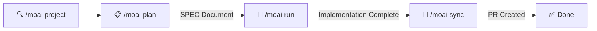

# moai-adk Overview

Agentic Development Kit for Claude Code - A high-performance AI development environment.

---

## What is MoAI-ADK?

MoAI-ADK is a **strategic orchestrator** for Claude Code that delegates development tasks to 28 specialized AI agents and 52 skills. It automatically applies hybrid methodology (TDD + DDD) and supports dual execution modes.

> **"The purpose of vibe coding is not rapid productivity but code quality."**

---

## Key Features

| Feature | Description |
|---------|-------------|
| **28 Specialized Agents** | Manager, Expert, Builder, and Team agents |
| **52 Skills** | Progressive disclosure system for token efficiency |
| **Hybrid Methodology** | TDD for new code, DDD for existing code |
| **Dual Execution Modes** | Sub-Agent (sequential) and Agent Teams (parallel) |
| **TRUST 5 Framework** | Quality gates for all code changes |
| **LSP Integration** | Real-time code quality validation |
| **Go-based** | Single binary, zero dependencies, ~5ms startup |

---

## Quick Start

```bash
# Install (macOS/Linux)
curl -fsSL https://raw.githubusercontent.com/modu-ai/moai-adk/main/install.sh | bash

# Initialize a project
moai init my-project

# Start developing with Claude Code
/moai project       # Generate project docs
/moai plan "Add user authentication"
/moai run SPEC-AUTH-001
/moai sync SPEC-AUTH-001
```

---

## Development Workflow



### Phase Overview

| Phase | Command | Agent | Token Budget | Purpose |
|-------|---------|-------|--------------|---------|
| Plan | `/moai plan` | manager-spec | 30K | Create SPEC document |
| Run | `/moai run` | manager-ddd/tdd | 180K | DDD/TDD implementation |
| Sync | `/moai sync` | manager-docs | 40K | Documentation & PR |

---

## Agent Categories

### Manager Agents (8)

Coordinate workflows and create SPEC documents.

| Agent | Purpose |
|-------|---------|
| `manager-spec` | Create SPEC documents with EARS format |
| `manager-ddd` | DDD implementation (ANALYZE-PRESERVE-IMPROVE) |
| `manager-tdd` | TDD implementation (RED-GREEN-REFACTOR) |
| `manager-docs` | Documentation generation |
| `manager-quality` | TRUST 5 quality validation |
| `manager-project` | Project configuration |
| `manager-strategy` | System design & architecture |
| `manager-git` | Git operations & branching |

### Expert Agents (9)

Domain-specific implementation and analysis.

| Agent | Purpose |
|-------|---------|
| `expert-backend` | API and server development |
| `expert-frontend` | UI and client development |
| `expert-security` | Security analysis |
| `expert-devops` | CI/CD and infrastructure |
| `expert-performance` | Performance optimization |
| `expert-debug` | Debugging & troubleshooting |
| `expert-testing` | Test creation & strategy |
| `expert-refactoring` | Code refactoring |
| `expert-chrome-extension` | Chrome Extension development |

### Builder Agents (3)

Create new MoAI components.

| Agent | Purpose |
|-------|---------|
| `builder-agent` | Create new agent definitions |
| `builder-skill` | Create new skills |
| `builder-plugin` | Create plugins |

### Team Agents (8) - Experimental

Parallel development with Agent Teams mode.

| Agent | Model | Purpose |
|-------|-------|---------|
| `team-researcher` | haiku | Codebase exploration |
| `team-analyst` | inherit | Requirements analysis |
| `team-architect` | inherit | Technical design |
| `team-backend-dev` | inherit | Server implementation |
| `team-designer` | inherit | UI/UX design |
| `team-frontend-dev` | inherit | Client implementation |
| `team-tester` | inherit | Test creation |
| `team-quality` | inherit | Quality validation |

---

## Supported Languages

| Category | Languages |
|----------|-----------|
| **Backend** | Go, Python, Rust, Java, Kotlin, C#, Node.js, Elixir, PHP |
| **Frontend** | TypeScript, JavaScript, Swift, Kotlin (Android) |
| **Systems** | C++, C, Go, Rust |
| **Data** | Python, R, Scala |
| **Mobile** | Swift, Kotlin, Flutter (Dart) |
| **Total** | 18 programming languages |

---

## CLI Commands

| Command | Description |
|---------|-------------|
| `moai init` | Interactive project setup |
| `moai doctor` | System health diagnosis |
| `moai status` | Project status summary |
| `moai update` | Update to latest version |
| `moai worktree` | Git worktree management |
| `moai hook <event>` | Claude Code hook dispatcher |
| `moai version` | Display version info |

[→ CLI Commands Reference](./cli-commands.md)

---

## Architecture

```
moai-adk/
├── cmd/moai/             # CLI entry point
├── internal/             # Core packages (32 total)
│   ├── cli/              # Cobra CLI commands
│   ├── core/
│   │   ├── git/          # Git operations
│   │   ├── project/      # Project initialization
│   │   └── quality/      # TRUST 5 validation
│   ├── hook/             # Hook system (14 events)
│   ├── lsp/              # LSP client (16+ languages)
│   ├── template/         # Template deployment
│   └── ui/               # Interactive TUI
└── pkg/                  # Public libraries
```

[→ Architecture Details](./architecture.md)

---

## Statistics

| Metric | Value |
|--------|-------|
| **Code** | 34,220 lines of Go |
| **Packages** | 32 packages |
| **Test Coverage** | 85-100% |
| **Agents** | 28 specialized agents |
| **Skills** | 52 progressive skills |
| **Languages** | 18 supported |
| **Hook Events** | 14 events |
| **Startup Time** | ~5ms native |

---

## Model Policy

MoAI-ADK assigns optimal AI models based on your Claude Code subscription.

| Policy | Plan | Opus | Sonnet | Haiku |
|--------|------|------|--------|-------|
| **High** | Max $200/mo | 23 | 1 | 4 |
| **Medium** | Max $100/mo | 4 | 19 | 5 |
| **Low** | Plus $20/mo | 0 | 12 | 16 |

Configure via: `moai update -c`

---

## Documentation

- [Architecture](./architecture.md)
- [Agents](./agents.md)
- [Skills](./skills.md)
- [CLI Commands](./cli-commands.md)
- [Development Guide](./development.md)
- [Quality Gates](./quality-gates.md)

---

*Last updated: 2026-03-01*
