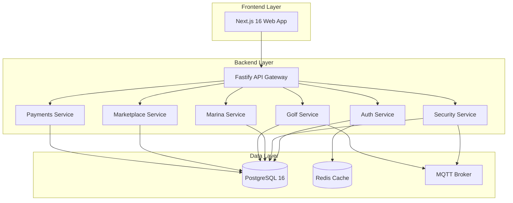
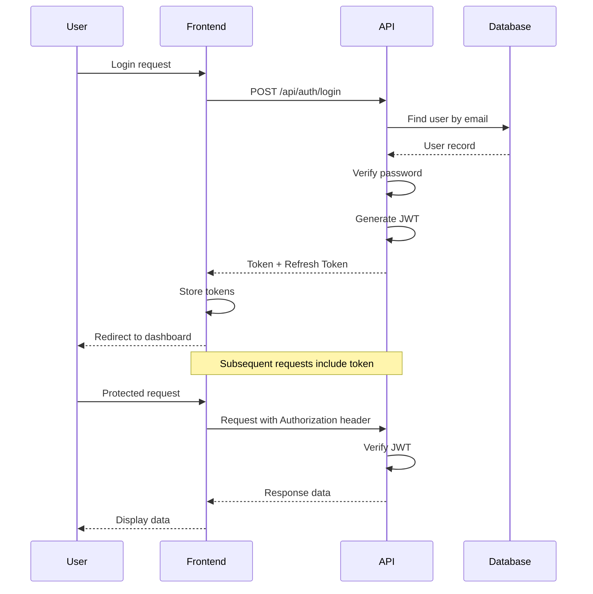
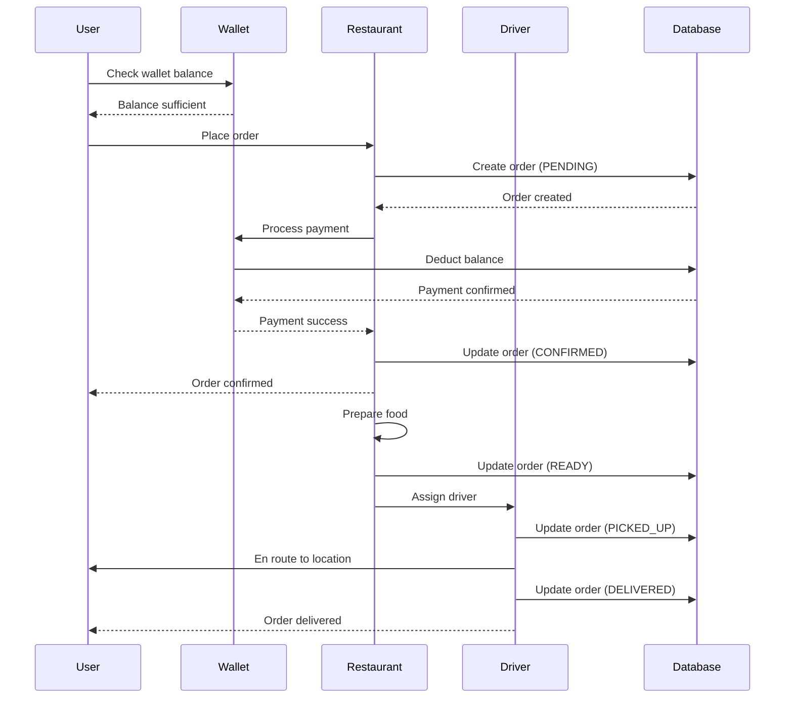

# Puerto Aventuras Architecture

System architecture and technical design.

---

## Overview

The Puerto Aventuras Super-App uses a **monorepo architecture** with Turborepo, separating frontend, backend, and shared packages.

---

## High-Level Architecture



---

## Technology Stack

### Frontend

| Component | Technology | Purpose |
|-----------|------------|---------|
| **Framework** | Next.js 16 | React framework |
| **UI Library** | React 19 | Component library |
| **Styling** | Tailwind CSS | Utility-first CSS |
| **State** | Zustand / Context | State management |
| **Forms** | React Hook Form | Form validation |
| **HTTP** | Fetch API / Axios | API client |

### Backend

| Component | Technology | Purpose |
|-----------|------------|---------|
| **Framework** | Fastify | Web framework |
| **Runtime** | Node.js 20+ | JavaScript runtime |
| **ORM** | Prisma | Database ORM |
| **Validation** | Zod | Schema validation |
| **Auth** | JWT + bcrypt | Authentication |
| **API** | RESTful | API architecture |

### Database

| Component | Technology | Purpose |
|-----------|------------|---------|
| **Database** | PostgreSQL 16 | Primary database |
| **Cache** | Redis | Session caching |
| **Broker** | MQTT | IoT messaging |

### DevOps

| Component | Technology | Purpose |
|-----------|------------|---------|
| **Monorepo** | Turborepo | Build system |
| **Packaging** | npm workspaces | Package management |
| **Testing** | Jest | Test framework |
| **Linting** | ESLint | Code linting |
| **Formatting** | Prettier | Code formatting |

---

## Monorepo Structure

### Packages

```
packages/
├── crypto/         # AES-256 encryption (100% coverage)
├── database/       # Prisma schema & migrations
├── auth/           # JWT authentication
├── shared/         # Shared types & utilities
└── config/         # Shared configuration
```

### Apps

```
apps/
├── web/            # Next.js frontend
└── api/            # Fastify backend
```

### Services

```
services/
├── security/       # QR, LPR, visitors
├── marina/         # Slips, reservations
├── golf/           # Tee times, facilities
├── marketplace/    # Restaurants, orders
└── payments/       # Wallet, transactions
```

---

## Package Dependencies

### Dependency Graph

```
@pa/crypto (standalone)
    ↓
@pa/database (uses @pa/crypto)
    ↓
@pa/auth (standalone)
    ↓
@pa/shared (utilities)
    ↓
apps/* and services/* (use all packages)
```

### Import Example

```typescript
// In any app or service
import { encrypt, decrypt } from '@pa/crypto';
import { prisma } from '@pa/database';
import { verifyToken } from '@pa/auth';
import { UserResponse } from '@pa/shared';
```

---

## API Architecture

### API Gateway Pattern

All requests go through the Fastify API Gateway:

```typescript
// apps/api/src/server.ts
import fastify from 'fastify';
import authPlugin from './plugins/auth';
import securityRoutes from './routes/security';
import marinaRoutes from './routes/marina';

const server = fastify();

// Register plugins
await server.register(authPlugin);

// Register routes
await server.register(securityRoutes, { prefix: '/api/security' });
await server.register(marinaRoutes, { prefix: '/api/marina' });
```

### Route Structure

```
/api
├── /auth          (authentication)
├── /security      (access control)
├── /marina        (boat slips)
├── /golf          (facilities)
├── /marketplace   (restaurants)
└── /payments      (wallet)
```

---

## Authentication Flow



### JWT Structure

```typescript
interface JWTPayload {
  userId: string;
  email: string;
  role: UserRole;
  iat: number;
  exp: number;
}
```

### Token Expiration

| Token Type | Expiration |
|------------|------------|
| Access Token | 15 minutes |
| Refresh Token | 7 days |

---

## Data Flow

### Order Flow (Marketplace)



---

## IoT Integration

### MQTT Topics

| Topic | Purpose | QoS |
|-------|---------|-----|
| `facility/+/light` | Light control | 1 |
| `facility/+/motion` | Motion detection | 0 |
| `facility/+/energy` | Energy monitoring | 0 |
| `facility/+/status` | Device status | 1 |

### Message Format

```json
{
  "facilityId": "fac_123",
  "deviceType": "LIGHT_CONTROLLER",
  "command": "ON",
  "timestamp": "2026-03-01T15:30:00Z"
}
```

---

## Security Architecture

### Encryption Layers

| Layer | Method | Purpose |
|-------|--------|---------|
| **Transit** | TLS 1.3 | Secure communication |
| **At Rest** | AES-256 | Database encryption |
| **PII** | AES-256-CBC | Personal data encryption |
| **Passwords** | bcrypt | Password hashing |

### Access Control

```typescript
// Role-based access control
const canAccess = (userRole: UserRole, resource: string): boolean => {
  const permissions = {
    RESIDENT: ['own-data', 'own-wallet', 'own-reservations'],
    STAFF: ['all-reservations', 'all-users'],
    ADMIN: ['everything'],
    PROVIDER: ['own-restaurant', 'own-orders']
  };

  return permissions[userRole].includes(resource);
};
```

---

## Performance Optimization

### Caching Strategy

| Cache Type | TTL | Purpose |
|------------|-----|---------|
| **Session** | 7 days | User sessions |
| **API** | 5 minutes | API responses |
| **Static** | 1 year | Static assets |

### Database Indexing

All frequently queried fields are indexed:

```prisma
@@index([userId])
@@index([status])
@@index([createdAt])
```

---

## Scalability Considerations

### Horizontal Scaling

- **API Servers:** Stateless, can scale horizontally
- **Database:** Read replicas for reads
- **Cache:** Redis Cluster for distributed caching
- **Files:** CDN for static assets

### Microservices Migration Path

Current monolithic API can be split into:

1. **Auth Service** - Authentication and authorization
2. **Security Service** - Access control and visitors
3. **Marina Service** - Marina operations
4. **Golf Service** - Golf and facilities
5. **Marketplace Service** - Restaurants and orders
6. **Payments Service** - Wallet and transactions

---

## Monitoring & Logging

### Application Monitoring

- **Error Tracking:** Sentry
- **Performance:** New Relic
- **Uptime:** Pingdom
- **Logs:** CloudWatch / Papertrail

### Metrics to Track

| Metric | Target |
|--------|--------|
| **API Response Time** | < 200ms (p95) |
| **Database Query Time** | < 50ms (p95) |
| **Error Rate** | < 0.1% |
| **Uptime** | 99.9% |

---

## Disaster Recovery

### Backup Strategy

| Component | Backup Frequency | Retention |
|-----------|------------------|-----------|
| **Database** | Hourly | 30 days |
| **Redis** | Daily | 7 days |
| **Files** | Real-time | 90 days |

### Recovery Time Objectives

| Metric | Target |
|--------|--------|
| **RPO** (Recovery Point) | 1 hour |
| **RTO** (Recovery Time) | 4 hours |

---

## Future Architecture

### Planned Enhancements

- [ ] GraphQL API (alternative to REST)
- [ ] Event-driven architecture (Kafka)
- [ ] Microservices migration
- [ ] Multi-region deployment
- [ ] Edge computing (Cloudflare Workers)
- [ ] Real-time updates (WebSockets)
- [ ] Mobile apps (React Native)

---

*Last updated: 2026-03-01*
